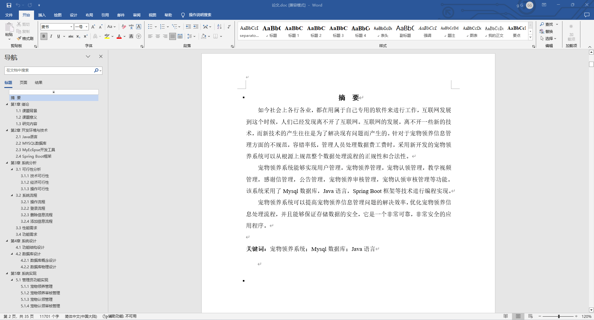
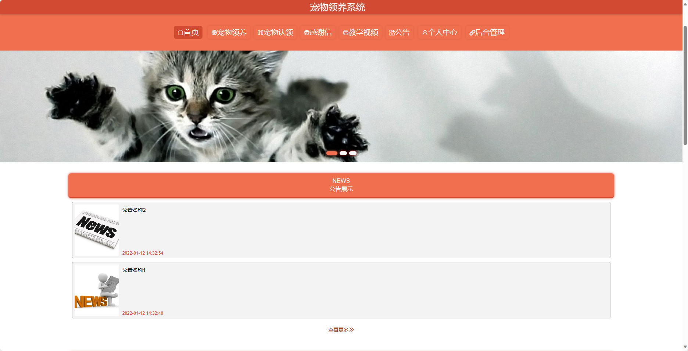
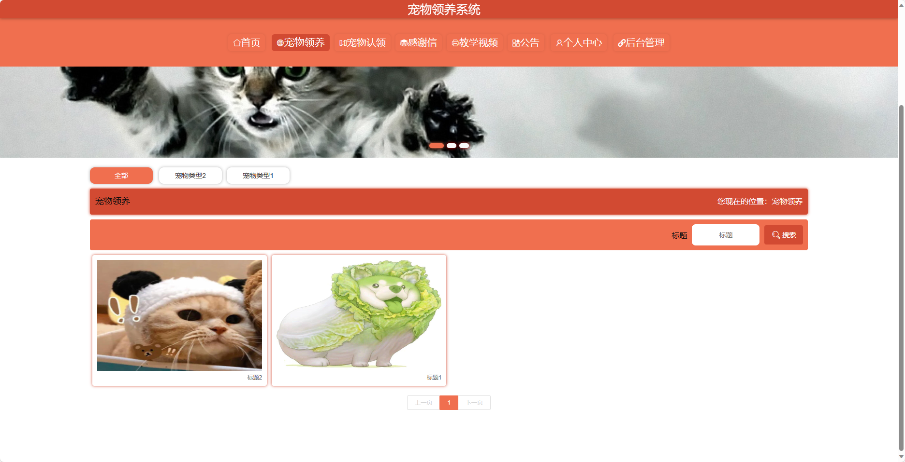
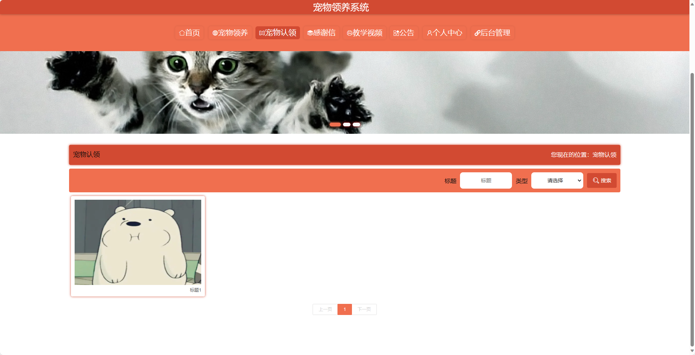
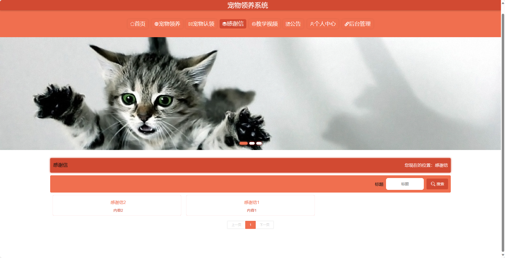
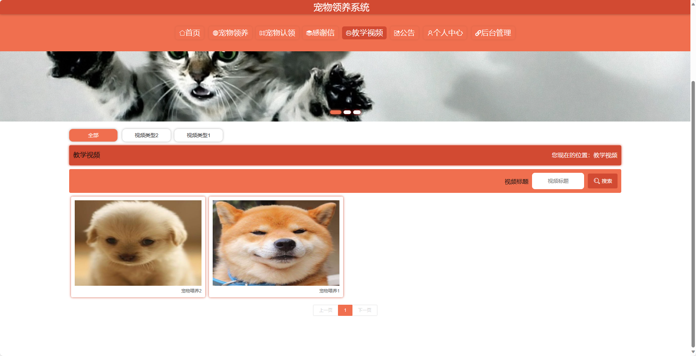
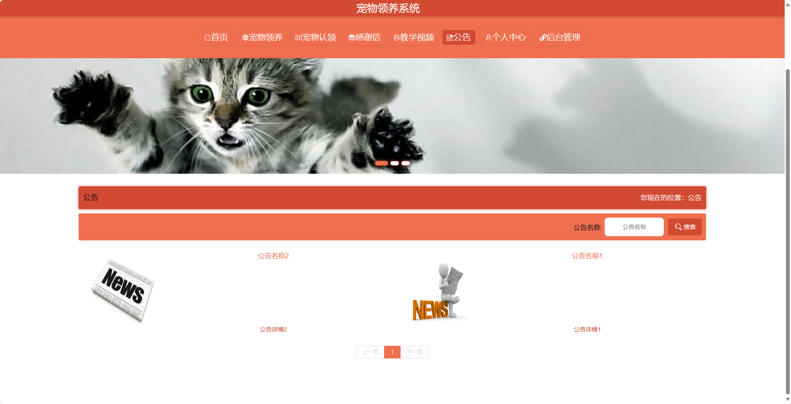
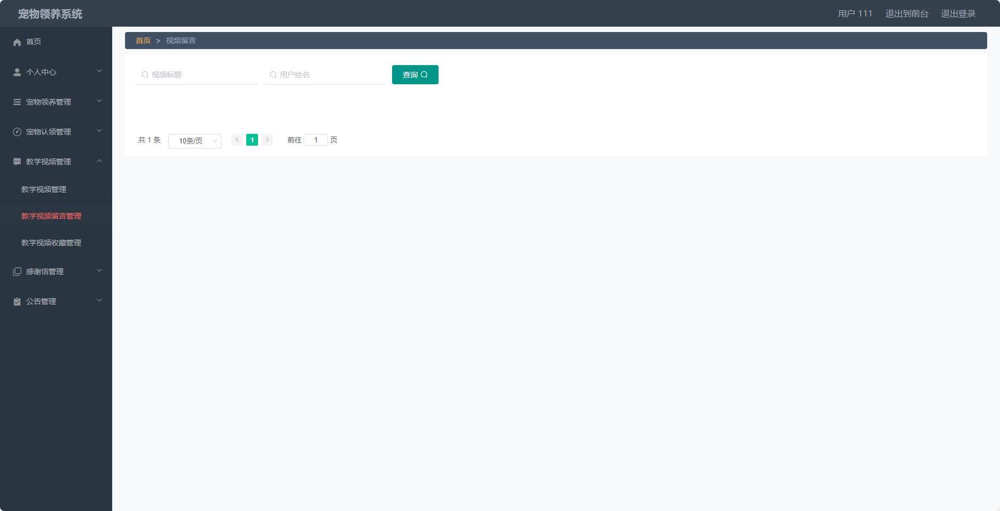
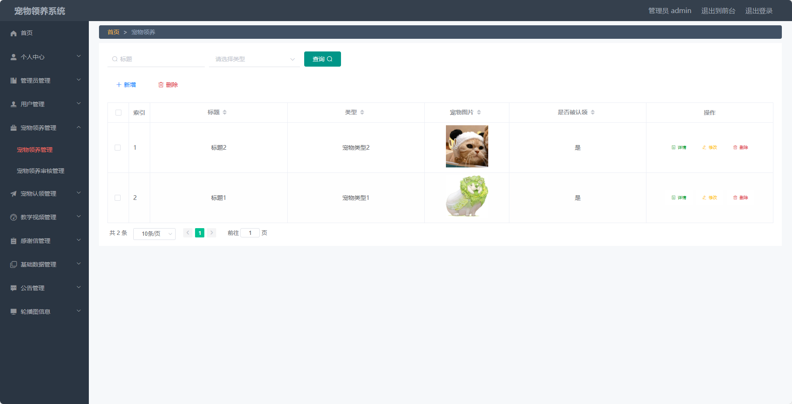

## 基于SpringBoot宠物领养系统(程序+报告)

- <b>完整代码获取地址：从戎源码网 ([https://armycodes.com/](https://armycodes.com/))</b>
- <b>技术探讨、资料分享，请加QQ群：692619798</b> 
- <b>作者微信：19941326836  QQ：952045282</b> 
- <b>承接计算机毕业设计、Java毕业设计、Python毕业设计、深度学习、机器学习</b>
- <b>选题+开题报告+任务书+程序定制+安装调试+论文+答辩ppt 一条龙服务</b>
- <b>所有选题地址 ([https://github.com/YuLin-Coder/AllProjectCatalog](https://github.com/YuLin-Coder/AllProjectCatalog)) </b>

## 项目介绍
基于SpringBoot宠物领养系统，系统包含两种角色：管理员、用户,系统分为前台和后台两大模块，主要功能如下。

### 【管理员】:
1. 个人中心：管理管理员个人信息和进行相关操作。
2. 管理员管理：管理系统内部管理员信息和权限。
3. 用户管理：管理系统内部用户信息和权限设置。
4. 宠物领养管理：管理宠物领养信息和审核领养申请。
5. 宠物认领管理：管理宠物认领信息和审核认领申请。
6. 教学视频管理：管理宠物教育和训练视频。
7. 感谢信管理：管理领养宠物后的感谢信。
8. 基础数据管理：管理宠物种类和基础数据。
9. 公告管理：发布和管理系统内部公告信息。
10. 轮播图信息：管理前台首页展示的轮播图信息。

### 【前台】:
1. 首页：展示宠物领养相关信息和公告。
2. 宠物领养：用户可以查看并申请领养宠物。
3. 宠物认领：用户可以发布宠物认领信息。
4. 感谢信：用户可以发布领养宠物后的感谢信。
5. 教学视频：展示相关的宠物教育和训练视频。
6. 公告：展示系统内部公告信息。
7. 个人中心：用户可以管理个人信息和查看领养记录和认领记录。

### 【用户】:
1. 个人中心：管理个人信息和进行相关操作。
2. 宠物领养管理：管理员宠物领养信息和审核领养申请。
3. 宠物认领管理：管理员宠物认领信息和审核认领申请。
4. 教学视频管理：管理宠物教育和训练视频。
5. 感谢信管理：管理领养宠物后的感谢信。
6. 公告管理：发布和管理系统内部公告信息。

## 项目技术
- 编程语言：Java
- 数据库：MySQL
- 项目管理工具：Maven
- 前端技术：HTML、CSS、JavaScript、Jquery、Vue
- 后端技术：Spring、SpringMVC、MyBatis

## 运行环境
- JDK版本：JDK1.8及以上
- 开发工具：IDEA、Ecplise、Myecplise都可以
- 数据库: MySQL5.7及以上
- Maven：maven3.0及以上
- Node：14.14.0及以上

## 运行截图

